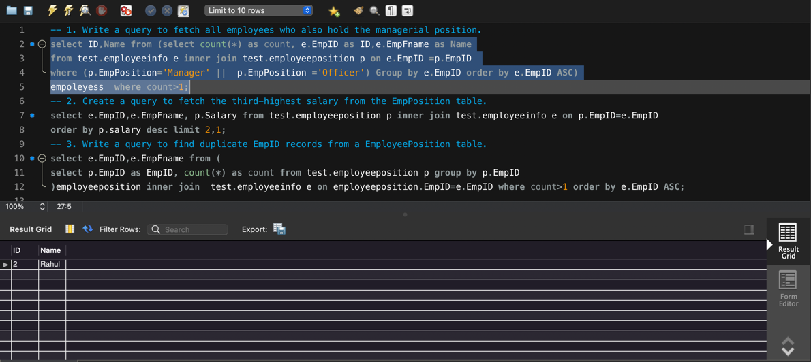

* EmployeeInfo  table:

|EmpID  |EmpFname   |EmpLname   |Department |Project    |Address    |DOB            |Gender|
|-------|-----------|-----------|-----------|-----------|-----------|---------------|--------|
| 1		|Rohit		|Gupta		|Admin		|P1			|Delhi	    |02/12/1979	    |Male|
| 2		|Rahul		|Mahajan	|Admin		|P2			|Mumbai	    |10/10/1986	    |Male| 
| 3		|Sonia		|Banerjee	|HR			|P3			|Pune	    |05/06/1983	    |Female| 
| 4		|Ankita		|Kapoor		|HR			|P4			|Chennai	|28/11/1983	    |Female| 
| 5		|Swati		|Garg		|HR			|P5			|Delhi	    |06/04/1991	    |Female| 

* EmployeePosition table:

|EmpID	|EmpPosition|  DateOfJoining| 	Salary  |
|-------|-----------|---------------|-----------|
|1		|Executive 	|01/04/2020		|75000      | 
|2		|Manager 	|03/04/2020		|500000      |
|3		|Manager	|02/04/2020		|150000      |
|2		|Officer	|02/04/2020		|90000      |
|1		|Manager 	|03/04/2020		|300000      |

> Assignment
>>1. Write a query to fetch all employees who also hold the managerial position.
> 
>>`select ID,Name from (select count(*) as count, e.EmpID as ID,e.EmpFname as Name
from test.employeeinfo e inner join test.employeeposition p on e.EmpID =p.EmpID
where (p.EmpPosition='Manager' ||  p.EmpPosition ='Officer') Group by e.EmpID order by e.EmpID ASC)
empoleyess  where count>1;`
> 

> 
>>2. Create a query to fetch the third-highest salary from the EmpPosition table.
>
>>`select e.EmpID,e.EmpFname, p.Salary from test.employeeposition p inner join test.employeeinfo e on p.EmpID=e.EmpID
order by p.salary desc limit 2,1;`
> 

> 
>>3. Write a query to find duplicate EmpID records from a EmployeePosition table.
> 
>>`select e.EmpID,e.EmpFname from (
select p.EmpID as EmpID, count(*) as count from test.employeeposition p group by p.EmpID
)employeeposition inner join  test.employeeinfo e on employeeposition.EmpID=e.EmpID where count>1 order by e.EmpID ASC;` 
> 

> 
> note :
> sql script given
> 

> table employeeInfo data
> 

> table employeePosition data
> 

> 
